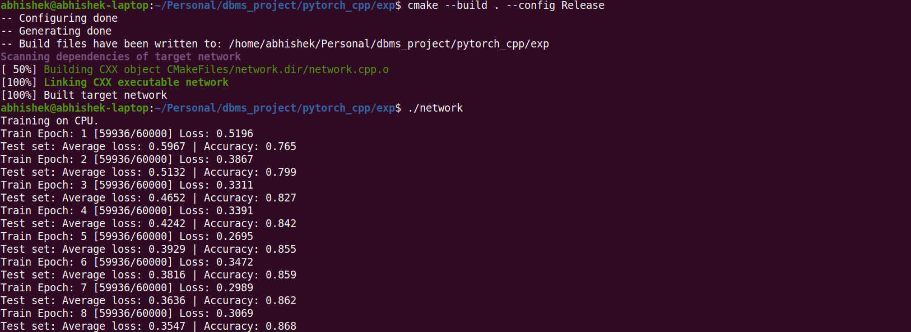

## Robust High Dimensional Stream Classification with Novel Class Detection

### Description -

The project is about the implementation of the stream classification problem , that deals with the unclassified data labels on the stream of the data , by using the algorithms that are defined in the paper , that uses the butter memory to store the values and use that to retrain the model again on the novel classes

### Requirements -

```tex
pytorch cpp api 
opencv cpp 
```

- The dataset can be downloaded with data_download.py 

  ```
  python3 data_download.py
  ```

- The dataset downloaded in the ubyte format 

- Edit the data path in the network.cpp file and after_trainer.cpp file 

  ```c++
  const char* kDataRoot = "/home/abhishek/Personal/dbms_project/pytorch_cpp/exp/fashion-mnist";  // the path
  ```

### Installation and running

- Install the dependencies 

- The CMakeLists.txt file has the dependencies for the file 

- Add the path for libtorch (pytorch api) in the file and edit the executable file if needed 

-  Use the command 

  - ```bash
    cmake --build . --config Release
    ```

  - To build the executable and run the file 

  - ```bash
    ./network
    ```

- The parameters can be tuned by the changing the parameters in network.cpp and after_trainer.cpp file 

  ```c++
  const int64_t NumberOfEpochs = 20;
  const int64_t LogInterval = 16;
  const int64_t Train_size = 16;
  const int64_t TestBatchSize = 16;
  const int64_t labelled_data = 5;
  const int64_t unlablled_data = 5;
  ```

- For the data stream generator run the commands as follows to generate the executable file 

  ```bash
  make 
  ```

- The command will generate the DisplayImage file 

### Running Outputs 

- The compiling and running 

  

- The retrainer part 

  

- The display image part 

  
  
- The framework
  

### Links

```tex
https://opencv.org/opencv-4-0/
https://pytorch.org/cppdocs/installing.html
```

